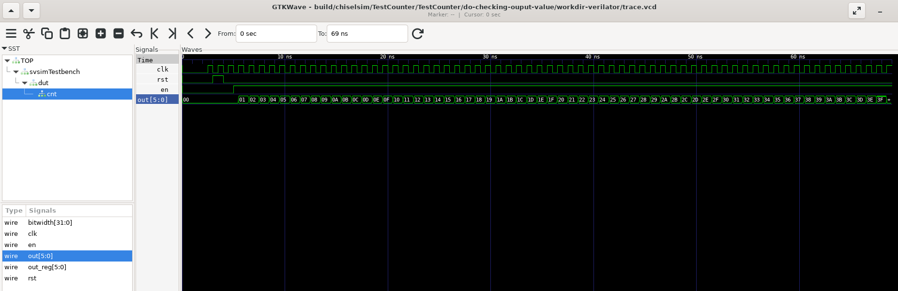

# Rocket-AES-GCM

## Introduction
The Advanced Encryption Standard (AES) is a kind of symmetric key cryptosystem that efficiently performs encryptions and decryption to ensure a secure communication channel. The main idea of the AES serves the long-term information as several blocks, which are called Block Ciphers.

This repository is to design a High-Performance Pipelined AES-GCM Accelerator using Verilog HDL and Chisel, providing an efficient solution when embedded in a system. That is, the processor can focus on other routines and hand over the encryption and decryption to the accelerator. The implementations reference my partner [ryanycs](https://github.com/ryanycs)'s work [ryanycs/aes](https://github.com/ryanycs/aes/tree/main), which can be also found in `ref/aes`.

This project aims to develop an open-source AES-GCM implementaion where we use pipelining technique to improve the performance. We wrapped it with the Chisel blackbox approach for future integration with the [Rocket](https://github.com/chipsalliance/rocket-chip), a RISC-V core generator.

## Overview
This repository includes source codes and testing codes developed based on the [Chipyard](https://chipyard.readthedocs.io/en/latest/) platform. The related steps for re-building this project can be also referenced from [Hackmd: High-Performance Pipelined AES-GCM Accelerator](https://hackmd.io/@sysprog/SJQ8oOsZZx).

The directory structure of this project is mainly composed of `src/`, `ref/`, and `scripts/`. The `syn/` is updating and currently stores the synthesis results of this project, which is synthesized by the [Yosys](https://github.com/YosysHQ/yosys), an open RTL synthesis tool. In `src/`, there are `main/` and `test/` which is the conventional structure for a Chipyard project. The `ref/` has the standard documents and the project mantained by my partner. `scripts/` has the testcase generator, responsible for producing required testcases.


```bash
# Main references
├── build.sbt
├── LICENSE
├── ref
│   ├── aes
│   ├── gcm-spec.pdf
│   ├── NIST.FIPS.197-upd1.pdf
│   ├── nistspecialpublication800-38a.pdf
│   └── nistspecialpublication800-38d.pdf
├── scripts
│   ├── data
│   ├── Makefile
│   └── testcase_generator.py
├── src
│   ├── main
│   │   ├── resources
│   │   │   └── vsrc
│   │   │       ├── aes_baseline
│   │   │       ├── aes_ctr
│   │   │       ├── aes_gcm
│   │   │       ├── aes_pipeline
│   │   │       │   └── bandwidth32
│   │   │       └── example
│   │   └── scala
│   └── test
│       ├── resources
│       │   ├── CTR
│       │   ├── ECB
│       │   └── GCM
│       └── scala
└── README.md
```
## Setup
### A. System
  The term project will be built and evaluated based on Ubuntu 24.04 LTS.
### B. Chipyard
* **setup**
``` bash
# create workspace
$ mkdir 1.13.0/
$ cd 1.13.0/
# Chipyard Repository
$ git clone git@github.com:ucb-bar/chipyard.git
# Specify version
$ cd chipyard
$ git checkout 1.13.0
# Repository setup (skip Firesim, FireMarshal, and CIRCT)
$ ./build-setup.sh riscv-tools -s 6 -s 7 -s 8 -s 9 -s 10
```

* **Project setup**
``` bash
# current directory:
# (base) user@host:~/1.13.0/chipyard/
$ source ./env.sh
# current directory:
# (${HOME}/1.13.0/chipyard/.conda-env) user@host:~/1.13.0/chipyard/
$ cd generators
$ git submodule add git@github.com:kyl6092/rocket-AES-GCM.git
```
Project Example [04be505](https://github.com/kyl6092/rocket-AES-GCM/commit/04be505e39afda76238d45ca0378e9fd92bfba75) (updated code [da8bd2e](https://github.com/kyl6092/rocket-AES-GCM/commit/da8bd2edc57c2c27adc1265a9a64d93b0c5d5d7e))
Modify the `chipyard/build.sbt` by appending project configurations:
```scala
// Custom AES-GCM
val chisel7Version = "7.6.0"

lazy val chisel7Settings = Seq(
  libraryDependencies ++= Seq("org.chipsalliance" %% "chisel" % chisel7Version),
  addCompilerPlugin("org.chipsalliance" % "chisel-plugin" % chisel7Version cross CrossVersion.full)
)        

lazy val MychiselSettings = chisel7Settings ++ Seq(
  libraryDependencies ++= Seq(
    "org.apache.commons" % "commons-lang3" % "3.12.0",
    "org.apache.commons" % "commons-text" % "1.9"
  )
)

lazy val rocket_AES_GCM = (project in file("generators/rocket-AES-GCM"))
  // .dependsOn(chipyard)
  .settings(
    MychiselSettings,
    commonSettings,
    scalaTestSettings
  )
```
    
In your terminal, execute `sbt "project rocket_AES_GCM"`

```bash
# current directory:
# (${HOME}/1.13.0/chipyard/.conda-env) user@host:~/1.13.0/chipyard/
$ sbt "project rocket_AES_GCM; testOnly TestHello"
[info] TestHello:
[info] Hello
[info] - do cheking output value
[info] Run completed in 4 seconds, 942 milliseconds.
[info] Total number of tests run: 1
[info] Suites: completed 1, aborted 0
[info] Tests: succeeded 1, failed 0, canceled 0, ignored 0, pending 0
[info] All tests passed.
```
Verilog Blackbox Example [2706882](https://github.com/kyl6092/rocket-AES-GCM/commit/27068820681477afcbf2b23d333a82c904260ad4) (updated code [da8bd2e](https://github.com/kyl6092/rocket-AES-GCM/commit/da8bd2edc57c2c27adc1265a9a64d93b0c5d5d7e))
```bash
$ sbt "project rocket_AES_GCM; testOnly TestCounter -- -DemitVcd=1"
1 2 3 4 5 6 7 8
9 10 11 12 13 14 15 16
17 18 19 20 21 22 23 24
25 26 27 28 29 30 31 32
33 34 35 36 37 38 39 40
41 42 43 44 45 46 47 48
49 50 51 52 53 54 55 56
57 58 59 60 61 62 63 0
[info] TestCounter:
[info] TestCounter
[info] - do checking ouput value
[info] Run completed in 4 seconds, 583 milliseconds.
[info] Total number of tests run: 1
[info] Suites: completed 1, aborted 0
[info] Tests: succeeded 1, failed 0, canceled 0, ignored 0, pending 0
[info] All tests passed.
```
In your `chipyard/build/chiselsim/TestCounter/TestCounter/do-checking-output-value/workdir-verilator/`, find the `trace.vcd` and open it with the GTKWave you can check and see something similar to belows:



---
## Contact Information
Feel free to email to us if you encounter problems, since this repository is still updating.

email: kuoyu6092@gmail.com